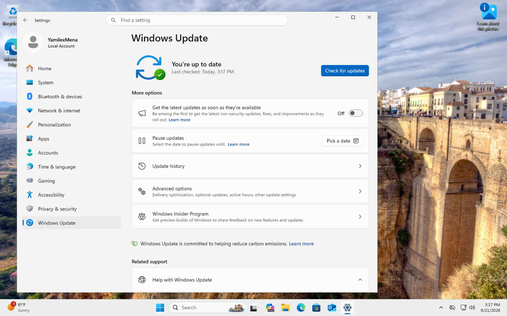
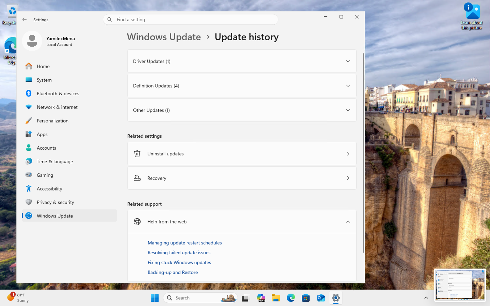
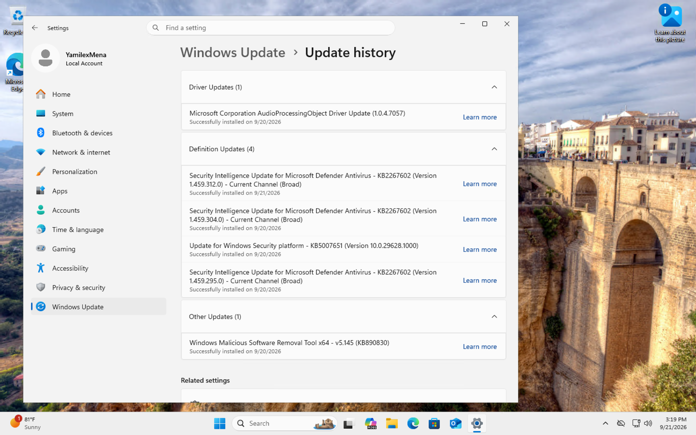

# Managing Windows Updates

## Project Overview

In this lab, I practiced reviewing and managing Windows Update activity inside a Windows 11 virtual machine.

I checked the current Windows Update status, reviewed the update history, and verified that multiple types of updates had been successfully installed.

The goal was to gain hands-on experience with common Windows maintenance tasks that may be performed in an IT support, help desk, or desktop support environment.

## Technologies Used

- Windows 11
- Windows Update
- Microsoft Azure Virtual Machine
- Microsoft Defender
- Remote Desktop Protocol (RDP)
- Windows Settings

## What I Practiced

- Navigating Windows Update settings
- Checking the current update status
- Verifying that a system is up to date
- Reviewing Windows Update history
- Identifying different update categories
- Reviewing successfully installed updates
- Identifying driver updates
- Reviewing Microsoft Defender security intelligence updates
- Reviewing Windows Security platform updates
- Verifying update installation dates
- Documenting Windows maintenance tasks

## Step 1: Check Windows Update Status

I opened **Settings > Windows Update** inside the Windows 11 virtual machine.

The Windows Update page showed:

**You're up to date**

This confirmed that Windows had already checked for available updates and that there were no additional required updates waiting to be installed at that time.

I had previously completed the update process during the original lab, so instead of reinstalling updates, I verified the current system status.

## Step 2: Review Update History

Next, I opened **Update history** to review the updates that had previously been installed on the virtual machine.

Windows organized the installed updates into multiple categories, including:

- Driver Updates
- Definition Updates
- Other Updates

This helped me understand how Windows separates different types of system updates and provides a history of completed installations.

## Step 3: Review Successfully Installed Updates

I expanded the update history categories to review the individual updates and their installation status.

The history showed successfully installed updates including:

- Microsoft driver updates
- Microsoft Defender Antivirus Security Intelligence updates
- Windows Security platform updates
- Windows Malicious Software Removal Tool updates

The update history also displayed the date each update was successfully installed.

This allowed me to verify that the Windows system had received both security-related updates and system maintenance updates.

## Update Management Summary

During this lab, I reviewed the Windows Update environment by:

1. Opening Windows Update settings
2. Confirming the system was currently up to date
3. Reviewing the Windows Update history
4. Identifying different update categories
5. Reviewing successfully installed security and system updates
6. Verifying update installation dates

This helped me become more familiar with the Windows Update interface and the information available when supporting or maintaining a Windows workstation.

## Skills Practiced

- Windows 11 Administration
- Windows Update Management
- Desktop Support
- System Maintenance
- Patch Verification
- Update History Review
- Driver Update Review
- Microsoft Defender Updates
- Security Update Verification
- Windows Troubleshooting
- IT Support
- Technical Documentation

## What I Learned

This lab helped me become more comfortable reviewing and managing Windows Update information.

I learned how to verify whether a Windows workstation is currently up to date, review previously installed updates, and identify the different types of updates that Windows tracks.

I also gained a better understanding of how update history can be used to verify that security, driver, and system maintenance updates have been successfully installed.

This project gave me hands-on experience with a common Windows maintenance task that may be performed in IT support, help desk, and desktop support environments.
